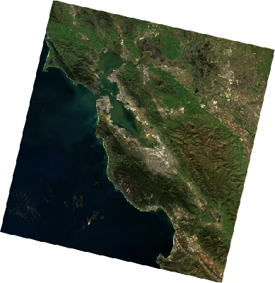

earthengine-jupyter
================

<!-- WARNING: THIS FILE WAS AUTOGENERATED! DO NOT EDIT! -->

**NOTICE: This is an experimental project and is not an officially
supported Google project. You are welcome to use it, but we do not
guarantee stability.**

## How to use

This lib contains a `Map` class that can be used to display an
interactive map.

``` python
import ee
from ee_jupyter.ipyleaflet import Map
```

``` python
# Intialize the Earth Engine client library.
ee.Initialize()
```

``` python
map1 = Map(center=(37.5924, -122.09), zoom=8)
map1
```

    Map(center=[37.5924, -122.09], controls=(ZoomControl(options=['position', 'zoom_in_text', 'zoom_in_title', 'zo…

Define an Earth Engine image layer, and add it to the interactive map.

``` python
img1 = ee.Image("LANDSAT/LC09/C02/T1_L2/LC09_044034_20220127")
visualization = {
    'bands': ['SR_B4', 'SR_B3', 'SR_B2'],
    'min': 0.2 / 0.0000275,
    'max': 0.4 / 0.0000275,
}
map1.addLayer(eeObject=img1, visParams=visualization, name='Landsat scene')
```

We can also create an inspector object and associate it with the
previously created map.

``` python
from ee_jupyter.ipyleaflet import Inspector

inspector1 = Inspector(map_object=map1)
inspector1
```

    Inspector(layout=Layout(border_bottom='solid', border_left='solid', border_right='solid', border_top='solid', …

Typically when you create a inspector object, you will want to display
it near the map.

``` python
from ipywidgets import HBox

display(HBox([map1, inspector1]))
```

    HBox(children=(Map(center=[37.5924, -122.09], controls=(ZoomControl(options=['position', 'zoom_in_text', 'zoom…

<div>

> **Tip With Caption**
>
> Note that when viewed on GitHub Pages you can manipulate Jupyter
> widgets independently, but the widgets do not interact with each
> other. To experience the cross-widget interactivity, open up this
> notebook in a Jupyter environment.

</div>

# Displaying a Map Image

If you want to display a static (non-interactive) image, you can do that
as well. The `embed=True` parameter will allow the image to be saved
within the notebook.

``` python
from IPython.display import Image


visualization['dimensions'] = 400  # maximum dimension for the image
url = img1.getThumbUrl(visualization)

Image(url=url, format='png', embed=True)
```


