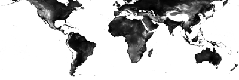

earthengine-jupyter
================

<!-- WARNING: THIS FILE WAS AUTOGENERATED! DO NOT EDIT! -->

``` python
# Copyright 2022 Google LLC
#
# Licensed under the Apache License, Version 2.0 (the "License");
# you may not use this file except in compliance with the License.
# You may obtain a copy of the License at
# 
#     https://www.apache.org/licenses/LICENSE-2.0
# 
# Unless required by applicable law or agreed to in writing, software
# distributed under the License is distributed on an "AS IS" BASIS,
# WITHOUT WARRANTIES OR CONDITIONS OF ANY KIND, either express or implied.
# See the License for the specific language governing permissions and
# limitations under the License.
```

**NOTICE: This is an experimental project and is not an officially
supported Google project. You are welcome to use it, but we do not
guarantee stability.**

## How to use

This lib contains a `map` class that can be used to display an
interactive map.

``` python
import ee
from earthengine_jupyter.map import JupyterMap
from earthengine_jupyter.inspector import MapInspector
from ipywidgets import HBox

ee.Initialize()
```

``` python
img = ee.Image("LANDSAT/LC09/C02/T1_L2/LC09_044034_20220127")
visualization = {
    'bands': ['SR_B4', 'SR_B3', 'SR_B2'],
    'min': 0.2 / 0.0000275 ,
    'max': 0.4 / 0.0000275,
};
```

``` python
map1 = JupyterMap(center=(37.5924, -122.09), zoom=8)
inspector1 = MapInspector(map_object=map1)

display(HBox([map1, inspector1]))
```

    HBox(children=(JupyterMap(center=[37.5924, -122.09], controls=(ZoomControl(options=['position', 'zoom_in_text'…

Add an Earth Engine image to the map.

``` python
map1.addLayer(img, visualization, 'Sample image');
```

# Test earthengine-api

``` python
from IPython.display import Image
```

``` python
print(img.getInfo()['id'])
```

    LANDSAT/LC09/C02/T1_L2/LC09_044034_20220127

# Displaying a Map Image

``` python
img2 = ee.Image('CGIAR/SRTM90_V4')
url = img2.getThumbUrl({'min':0, 'max':3000, 'dimensions':'400'})
print(url)

Image(url=url, format='png', embed=True)
```

    https://earthengine.googleapis.com/v1alpha/projects/earthengine-legacy/thumbnails/ac806a13e67cc8e1151e9189b409c500-5820392a72f0c768b305ace45f5b662a:getPixels


